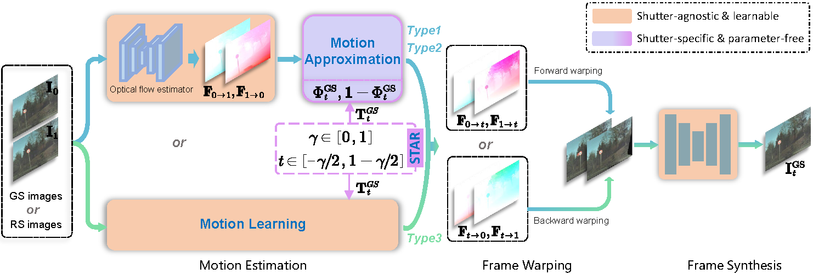

# Unified Video Reconstruction for Rolling Shutter and Global Shutter Cameras

This repository contains the source code for the paper: [Unified Video Reconstruction for Rolling Shutter and Global Shutter Cameras].
Currently, the general domain of video reconstruction (VR) is fragmented into different shutters spanning global shutter and rolling shutter cameras. Despite rapid progress in the state-of-the-art, existing methods overwhelmingly follow shutter-specific paradigms and cannot conceptually generalize to other shutter types, hindering the uniformity of VR models. In this paper, we propose UniVR, a versatile framework to handle various shutters through unified modeling and shared parameters. Specifically, UniVR encodes diverse shutter types into a unified space via a tractable shutter adapter, which is parameter-free and thus can be seamlessly delivered to current well-established VR architectures for cross-shutter transfer. To demonstrate its effectiveness, we conceptualize UniVR as three shutter-generic VR methods, namely **Uni-SoftSplat**, **Uni-SuperSloMo**, and **Uni-RIFE**. Extensive experimental results demonstrate that the pre-trained model without any fine-tuning can achieve reasonable performance even on novel shutters. After fine-tuning, new state-of-the-art performance are established that go beyond shutter-specific methods and enjoy strong generalization. 



## Installation
The code is tested with PyTorch 1.9.1 with CUDA 11.4.

Install the dependent packages:
```
pip install -r requirements.txt
```

In our implementation, we borrowed the code framework of [DeepUnrollNet](https://github.com/ethliup/DeepUnrollNet):

#### Install core package
```
cd ./package_core
python setup.py install
```

Furthermore, we adopted the pre-trained optical flow estimation method [GMFlow](https://github.com/haofeixu/gmflow). The versions using [RAFT](https://github.com/princeton-vl/RAFT) and [PWCNet](https://github.com/sniklaus/pytorch-pwc) can be adapted similarly. The optical flow estimator is frozened during training.

Meanwhile, the original GS-based video frame interpolation methods, i.e., [SoftSplat](https://github.com/JHLew/SoftSplat-Full), [SuperSloMo](https://github.com/avinashpaliwal/Super-SloMo), and [RIFE](https://github.com/megvii-research/ECCV2022-RIFE), are employed as well. They are extended to be compatible with GS and RS video reconstruction. Notably, we propose three UniVR variants here, i.e., `Uni-SoftSplat`, `Uni-SuperSloMo`, and `Uni-RIFE`, which can be trained and tested separately through their corresponding files.

## Demo with our pretrained model
Please **download the pre-trained models** through [Baidu Netdisk](https://pan.baidu.com/s/19EcTXzVoVVk8_JBiffKsWw) (link: https://pan.baidu.com/s/19EcTXzVoVVk8_JBiffKsWw
Extraction code: 1234) and put them in the `deep_unroll_weights` folder of each UniVR-model.

One can test our proposed three UniVR methods with the provided rolling shutter images (one set of data for each of the Carla-RS and Fastec-RS datasets here) in the `demo_video` folder.

To generate a global shutter video (11 video frames) from two consecutive rolling shutter images, simply run
```
sh demo_video.sh
```
The visualization results will be stored in the `experiments` folder. Note that additional examples can also be tested for the test set of the BS-RSC dataset.

## Datasets
- **Carla-RS** and **Fastec-RS:** Download these two datasets to your local computer from [here](https://github.com/ethliup/DeepUnrollNet).
- **BS-RSC:** Download this real-world dataset to your local computer from [here](https://github.com/ljzycmd/BSRSC).

## Training and evaluating
You can run following commands to re-train the network. Note that this is fine-tuning based on the pre-trained model in the `Pretrained` folder. If you want to train from scratch, please comment out the line self.load_pretrained_GS_model(self.opts.model_label_pretrained_GS, self.opts.log_dir_pretrained_GS) in `model_UniVR.py`.
```
# !! Please update the corresponding paths in 'train_carla.sh', 'train_fastec.sh' and 'train_bsrsc.sh'  #
# !! with your own local paths, before run following command!!      #

sh train_carla.sh
sh train_fastec.sh
sh train_bsrsc.sh
```

You can run following commands to obtain the quantitative evaluations.
```
# !! Please update the path to test data in 'inference.sh'
# !! with your own local path, before run following command!!

sh inference.sh
```

## Citations
Please cite our paper if necessary:
```

```

## Statement
This project is for research purpose only, please contact us for the licence of commercial use. For any other questions or discussion please contact: binfan@mail.nwpu.edu.cn
